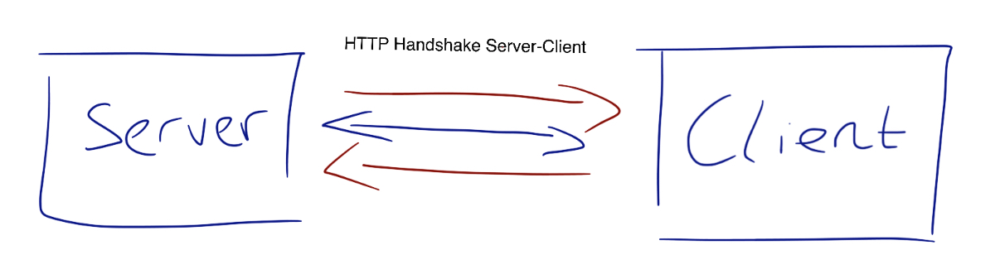
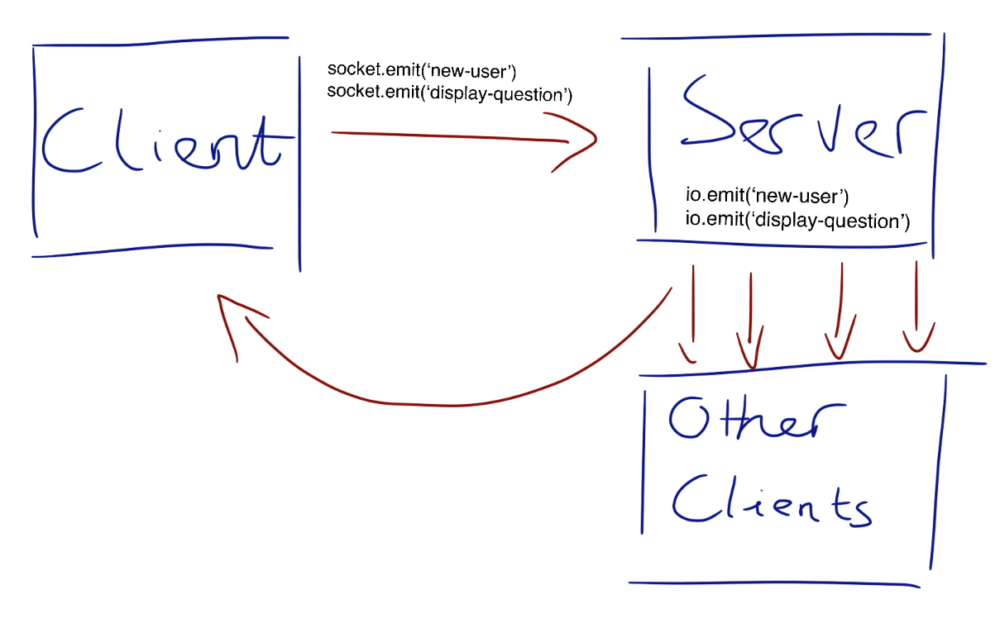
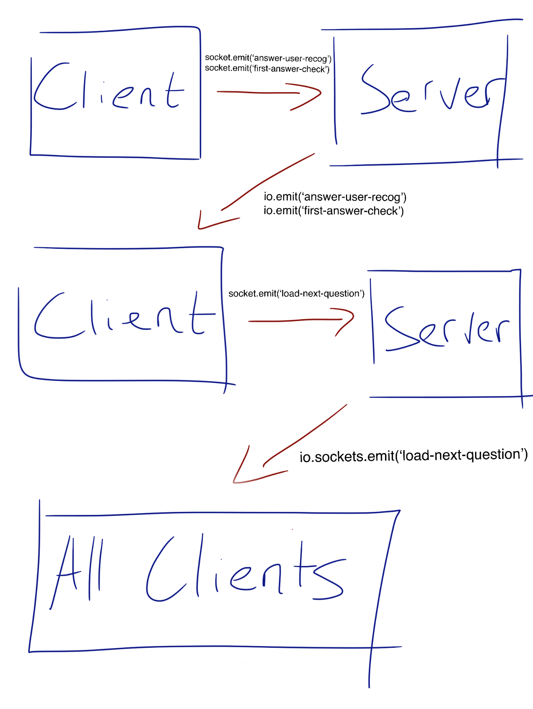
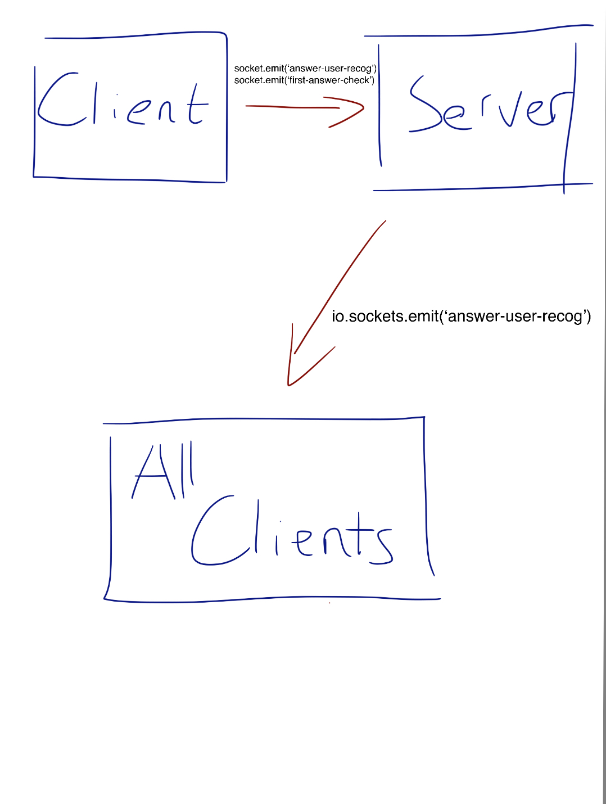

# The overall interaction between client and server can be summarized through diagrams below

The application starts by initiating a HTTP handshake and upgrades to a websocket connection.

## Initializing New Users and Displaying Math Question
Once the user has given their username in the username form on client side, the client will send off two events to the server called 'new-user' and 'display-question'. The first event would send the username of the player to the server to update and store in users list, and the 'display-question' would simply flag the server that the client is ready so the sever would send the on-going question to the new client. Then the server would emit 'new-user' event for clients to update the total players counter.

## Receiving Correct Answers and Updating Questions
The game is built so that once the first correct answer has been received, there would be a 10 second countdown for other players to finish up their working outs and put in their answers. So there are two scenarios on if-else condition:

- The answer received IS the first answer. So once the correct answer is submitted by player, the client would emit two events: 'answer-user-recog' and 'first-answer-check'. Upon getting the two events, the answer would update the score attribute of the player emit back 'answer-user-recog' for all players to see that someone has got the answer. All the while the server checks if this submission is the first answer or not, since this scenario is the first answer, the server would emit 'load-next-question' event for all clients and updating the server internal value (first_answer) so that other incoming answers for the round are not passed as 'first-answer'.

- The answer received IS NOT the first answer. If we continue from the scenario above, someone got the first answer, what happens to the 2nd answer? For the second answer, the score would update and get broadcasted to everyone just the same via the event 'answer-user-recog', however, the server will not emit 'load-next-question', this is to prevent layering on question skips.

